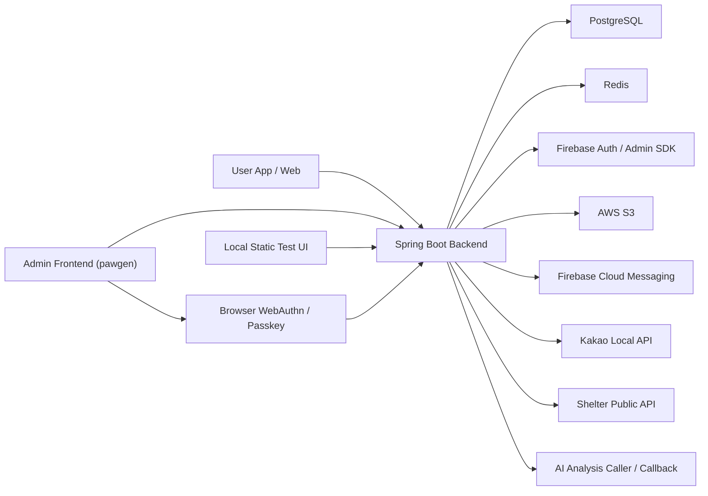

# Pogun Backend

Pogun backend. Spring Boot 4 API server for missing-pet notices, shelter notices, community, DM, notifications, presence, admin console, and AI similarity workflows.

---

## 1. 프로젝트 개요 (KR)

이 저장소는 **Pogun 서비스 백엔드**입니다.  
주요 책임:

- Firebase Google / Apple 로그인 검증
- 사용자 온보딩, 프로필, 지역, 탈퇴 처리
- 실종 공고 / 보호소 공고 / 커뮤니티 CRUD 및 검색
- 공고 기반 1:1 DM 채팅 및 읽음 처리
- FCM 기반 앱 푸시 및 인앱 알림
- Redis 기반 presence 추적
- 관리자 세션, 권한, Passkey(WebAuthn) step-up
- AI 분석 결과 수신 및 유사 공고 연결
- 운영용 관리자 대시보드 / 트래픽 로그 / 알림 발송

핵심 특성:

- 영속 데이터: PostgreSQL
- 단기 상태 / presence / 캐시: Redis
- 인증 원천: Firebase ID Token
- 파일 저장: AWS S3
- 실시간 채팅: STOMP WebSocket (`/ws/chat`)
- 운영 배포: GitHub Actions -> Docker Hub -> EC2

---

## 2. Project Overview (EN)

This repository contains the **Pogun backend**.

Primary responsibilities:

- Verify Firebase Google / Apple sign-in
- Handle onboarding, profile, region, and account withdrawal
- Provide CRUD and search for missing-pet notices, shelter notices, and community posts
- Support notice-based 1:1 direct messaging with read receipts
- Deliver in-app notifications and FCM push
- Track user presence with Redis
- Manage admin session, permissions, and Passkey(WebAuthn) step-up
- Receive AI analysis results and connect similar notices
- Provide admin dashboard, traffic logs, and broadcast notification APIs

Core platform choices:

- Persistent storage: PostgreSQL
- Short-lived state / presence / cache: Redis
- Identity source: Firebase ID Token
- File storage: AWS S3
- Realtime chat: STOMP WebSocket (`/ws/chat`)
- Deployment path: GitHub Actions -> Docker Hub -> EC2

---

## 3. 시스템 아키텍처 / System Architecture



### KR

- 일반 사용자 앱과 관리자 프론트는 같은 백엔드를 사용합니다.
- 일반 API는 Firebase 인증 기반입니다.
- 관리자 API는 Firebase 로그인 이후 백엔드 관리자 세션 + Passkey step-up을 사용합니다.
- 채팅은 WebSocket, 나머지 대부분은 REST API 중심입니다.
- Presence, 캐시, 일부 단기 상태는 Redis를 사용합니다.

### EN

- User clients and the admin frontend share the same backend.
- General APIs use Firebase-backed authentication.
- Admin APIs use Firebase sign-in followed by backend-issued admin session plus Passkey step-up.
- Chat uses WebSocket, while most other features use REST APIs.
- Presence, cache, and short-lived state are stored in Redis.

---

## 4. 런타임 스택 / Runtime Stack

- Java 17
- Spring Boot 4
- Spring MVC
- Spring Security
- Spring Data JPA / Hibernate
- PostgreSQL
- Spring Data Redis
- Spring WebSocket + STOMP
- AWS SDK v2 S3
- Firebase Admin SDK
- Firebase Cloud Messaging
- Yubico `webauthn-server-core`
- Zalando Logbook
- springdoc OpenAPI / Swagger UI
- Bun + Playwright for browser E2E

---

## 5. 도메인 구조 / Domain Structure

기준 패키지: `src/main/java/com/example/pogun`

- `config`
  - 보안, Firebase, S3, WebSocket, warmup, 인덱스 초기화, presence, 로깅
- `controller`
  - REST / WebSocket 진입점
- `service`
  - 핵심 비즈니스 로직
- `repository`
  - JPA persistence
- `entity`
  - DB 모델
- `dto`
  - 요청 / 응답 스펙

주요 도메인:

- `auth`, `user`
- `admin`, `adminauth`
- `missingpet`
- `shelterpet`
- `community`
- `noticechat`
- `notification`
- `presence`
- `ai`
- `storage`

---

## 6. 주요 기능 / Major Features

### KR

- **인증 / 사용자**
  - Firebase ID Token 검증
  - Pending social signup -> onboarding -> user 생성
  - Google / Apple provider 동기화

- **관리자 콘솔**
  - 관리자 로그인
  - 관리자 세션 발급 / 갱신
  - Passkey 등록 / MFA / step-up
  - 사용자 / 공고 / 신고 / 알림 / 트래픽 조회

- **실종 공고 / 보호소 공고**
  - 목록 / 상세 / 검색 / 작성 / 수정 / 삭제
  - AI source / analysis result / similar notices
  - 인덱스 및 캐시 기반 조회 최적화

- **커뮤니티**
  - 게시글 / 댓글 / 대댓글 / 좋아요 / 투표
  - 관리자 상세 조회 지원

- **DM**
  - 공고 기반 1:1 채팅
  - 실시간 메시지 전송
  - 읽음 처리
  - 이미지 메시지
  - 오프라인 수신자에만 푸시

- **알림**
  - 인앱 알림 저장
  - 읽음 / 전체 읽음
  - FCM 토큰 관리
  - 관리자 브로드캐스트

- **Presence**
  - `ONLINE / IDLE / OFFLINE`
  - Redis session store
  - stale session reconcile

### EN

- **Auth / User**
  - Firebase ID Token verification
  - Pending social signup -> onboarding -> user creation
  - Google / Apple provider synchronization

- **Admin Console**
  - Admin sign-in
  - Admin session issue / refresh
  - Passkey registration / MFA / step-up
  - User / notice / report / notification / traffic inspection

- **Missing Pet / Shelter**
  - List / detail / search / create / update / delete
  - AI source / analysis result / similar notices
  - Index and cache based query optimization

- **Community**
  - Posts / comments / replies / likes / polls
  - Admin detail inspection support

- **DM**
  - Notice-based 1:1 chat
  - Realtime delivery
  - Read receipts
  - Image messages
  - Push only for offline receivers

- **Notifications**
  - In-app notification persistence
  - Read / read-all
  - FCM token management
  - Admin broadcast send

- **Presence**
  - `ONLINE / IDLE / OFFLINE`
  - Redis-backed session store
  - Stale-session reconciliation

---

## 7. 인증 흐름 / Authentication Model

### 일반 사용자 / User

1. Client gets Firebase ID Token.
2. Client calls `POST /api/auth/login`.
3. Backend verifies token with Firebase.
4. Backend returns:
   - completed user session context, or
   - pending onboarding state

### 관리자 / Admin

1. Admin frontend gets Firebase ID Token.
2. Frontend calls `POST /api/admin/auth/login`.
3. Backend verifies admin eligibility and email verification state.
4. Backend returns next step:
   - email verification required
   - passkey registration required
   - MFA / step-up required
   - authenticated
5. Backend issues admin session token after successful admin flow.

보안 경계:

- `/api/admin/auth/login`: public entry
- `/api/admin/auth/**`: `ROLE_ADMIN_CONSOLE`
- `/api/admin/**`: `ROLE_ADMIN`
- 일반 `/api/**`: Firebase 인증 필요

---

## 8. 실시간 구조 / Realtime Architecture

### WebSocket

- Endpoint: `/ws/chat`
- Broker prefixes: `/topic`, `/queue`
- Application prefix: `/app`
- User prefix: `/user`

### DM flow

1. Client connects to `/ws/chat`.
2. STOMP auth interceptor verifies Firebase token.
3. Message send enters controller/service.
4. Message persists in PostgreSQL.
5. Backend fans out room/user updates through STOMP.
6. Push notification goes through async event listener only when receiver is offline.

### Presence flow

- REST heartbeat: `POST /api/presence/heartbeat`
- WebSocket activity also refreshes presence
- Redis stores active presence sessions
- Scheduler reconciles stale sessions

---

## 9. 데이터 저장 / Data Storage

### PostgreSQL

- Source of truth for users, notices, community, chat, notifications, admin data
- JPA / Hibernate with `ddl-auto: update`
- Query/index optimization applied in missing pet and community paths

### Redis

- Presence session state
- Cache for selected read-heavy APIs
- Short-lived operational state

### AWS S3

- Profile images
- Notice images
- Community images
- DM image uploads

---

## 10. 외부 연동 / External Integrations

- Firebase Auth / Admin SDK
- Firebase Cloud Messaging
- AWS S3
- Kakao Local API
- Shelter Public API
- AI callback / similarity pipeline

---

## 11. 로컬 실행 / Local Development

### 요구사항 / Prerequisites

- Java 17
- Bun
- Docker / Docker Compose
- PostgreSQL / Redis connection via env

### 환경 파일 / Environment Files

- `.env`
  - shared runtime values
- `.env.local`
  - local-only overrides

### 앱 실행 / Run Application

```bash
./gradlew bootRun
```

또는 Docker Compose:

```bash
docker compose up -d
```

기본 헬스체크:

```bash
GET /health
```

---

## 12. 테스트 / Testing

### 백엔드 테스트 / Backend Tests

```bash
./gradlew test
```

### 빌드 산출물 / Boot Jar

```bash
./gradlew bootJar
```

### Playwright E2E

```bash
bunx playwright test --config=playwright/playwright.config.ts
```

또는 package script:

```bash
bun run playwright:test
```

리포트:

```bash
bun run playwright:report
```

---

## 13. CI/CD 파이프라인 / CI/CD Pipeline

파일: `.github/workflows/deploy-ec2.yml`

### KR

배포 흐름:

1. `dev` 브랜치 push 또는 수동 실행
2. GitHub Actions가 checkout
3. JDK 17 / Gradle cache 세팅
4. `./gradlew test bootJar --build-cache --parallel`
5. Docker image build + push
6. 이전 SHA 태그 cleanup
7. EC2에 `docker-compose.yml` 업로드
8. EC2 `.env` 생성
9. `docker compose pull`
10. Redis 보장 후 app 재기동
11. `/health` 통과 시 배포 완료

### EN

Deployment path:

1. Push to `dev` or trigger workflow manually
2. GitHub Actions checks out code
3. Sets up JDK 17 and Gradle cache
4. Runs `./gradlew test bootJar --build-cache --parallel`
5. Builds and pushes Docker image
6. Cleans old SHA tags
7. Uploads `docker-compose.yml` to EC2
8. Writes runtime `.env` on EC2
9. Pulls fresh image
10. Ensures Redis is healthy, then restarts app
11. Finalizes deploy after `/health` passes

---

## 14. Docker 구성 / Docker Layout

### Dockerfile

- Multi-stage build
- Extracts layered Spring Boot jar
- Runs from slim Debian runtime
- Uses custom healthcheck + entrypoint scripts
- Excludes `static/**` from `bootJar`

### docker-compose.yml

- `app`
  - backend container
  - env-driven port / startup opts
  - depends on Redis health
- `redis`
  - Redis 7 alpine
  - optional password
  - persistent volume

---

## 15. 관측 / Observability

- `GET /health`
- Swagger / OpenAPI
- Zalando Logbook based admin traffic logging
- Admin traffic APIs
- Admin dashboard summary APIs
- Presence-derived admin user state inspection

---

## 16. 문서 인덱스 / Documentation Index

아래 문서들이 세부 구현을 설명합니다.

- [Backend Architecture](docs/backend-architecture.md)
- [DM WebSocket Integration Guide](docs/dm-websocket-integration-guide.md)
- [Admin User Presence](docs/admin-user-presence.md)
- [Admin Traffic and Notification Guide](docs/admin-traffic-and-notification-guide.md)
- [Admin Traffic Polling Fix](docs/admin-traffic-config-polling-fix.md)
- [AI Similar Notices Flow](docs/AI-Similar-Notices-Flow.md)
- [Missing Pet Region Scope Guide](docs/missing-pet-region-scope-guide.md)
- [Admin Community Post Detail](docs/admin-community-post-detail.md)
- [Admin Feature](docs/Admin-Feature.md)
- [Admin Fetch](docs/Admin-Fetch.md)

---

## 17. 빠른 시작 포인트 / Recommended Entry Points

코드 파악 순서:

1. `src/main/java/com/example/pogun/DemoApplication.java`
2. `src/main/resources/application.yml`
3. `src/main/java/com/example/pogun/config/security/SecurityConfig.java`
4. `src/main/java/com/example/pogun/service/auth/AuthService.java`
5. `src/main/java/com/example/pogun/service/adminauth/AdminAuthService.java`
6. `src/main/java/com/example/pogun/service/missingpet/MissingPetService.java`
7. `src/main/java/com/example/pogun/service/shelterpet/ShelterPetService.java`
8. `src/main/java/com/example/pogun/service/community/CommunityService.java`
9. `src/main/java/com/example/pogun/service/noticechat/NoticeChatService.java`
10. `src/main/java/com/example/pogun/service/notification/NotificationService.java`
11. `src/main/java/com/example/pogun/service/user/UserPresenceService.java`
12. `.github/workflows/deploy-ec2.yml`

---

## 18. Repository Status

- Main app profile: env-driven
- Admin Passkey runtime: enabled through backend config
- Static backend test pages: local/test usage, excluded from production bootJar
- Production deploy target: Docker on EC2

